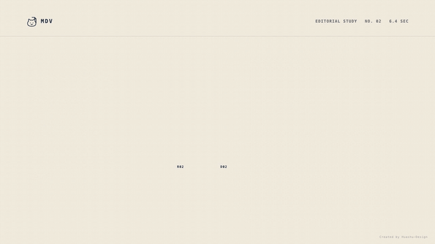

<p align="right">
  <strong>English</strong> · <a href="README.md">简体中文</a>
</p>

<p align="center">
  
</p>

<h1 align="center">MDV</h1>

<p align="center"><strong>Markdown, with memory.</strong></p>

<p align="center">Stop rewriting prompts · Keep the human original · Trace every delivery</p>

<p align="center">
  <a href="https://github.com/owariband/mdv/actions/workflows/ci.yml"></a>
  <a href="LICENSE"></a>
  
</p>

<p align="center">
  <a href="#why-mdv">Why MDV</a> ·
  <a href="#what-we-ship">What we ship</a> ·
  <a href="#see-mdv-in-motion">Motion</a> ·
  <a href="#one-minute-start">Quick start</a> ·
  <a href="docs/README.md">Docs</a> ·
  <a href="spec/format-0.1.md">Format spec</a>
</p>

AI keeps getting better, and we keep inviting it deeper into writing and editing. Most document workflows have not caught up: the more capable AI becomes, the more dangerous it is to leave context scattered across conversations and documents reduced to only their latest state.

Move to a new conversation, model, or Agent, and a person has to paste the prompts, requirements, background, and constraints all over again. Let AI edit Markdown directly, and the “latest result” can easily replace the document a person originally wrote, along with every intermediate revision. A finished document remains, but two basic questions become hard to answer: **Which version of the request produced it, and which human-authored version did it evolve from?**

**MDV was launched for this moment.** It stores prompts, briefs, and background material as the **Reference**, while the human original and later human–AI drafts live in the **Document**. Both stay inside one `.mdv` file, but each can be edited and committed into its own immutable history. The next Agent can recover the context from that same file, and every Document Version can bind to the exact Reference Version it actually used.

> **MDV is public through its GitHub source.** Format 0.1, Core, the VS Code Plugin, and the Agent Tool are open in this repository. MDV Desktop is also included as a source-build Preview, but it does not yet ship an installer, signing, or auto-update. GitHub source remains the public distribution channel.

## Why MDV

| The problem in AI document workflows | MDV's answer |
| --- | --- |
| Every new session means rewriting prompts and explaining the context again | Keep prompts, briefs, rules, and background in a reusable, versioned Reference that the next Agent can read directly |
| AI leaves only the latest result, while the human original and intermediate revisions get overwritten | Give the Document its own history; every explicit commit creates an immutable version, so the original and every committed revision remain recoverable |
| Both the document and its instructions change, making it unclear which request produced a result | Bind every Document Version to the exact Reference Version it used, making the relationship traceable, comparable, and verifiable |

MDV—Markdown Document with Versions—gives a Markdown workflow portable memory, so you do not have to trade away the human original to gain the convenience of AI. It does not require you to replace your editor: keep using VS Code, or choose the focused Desktop Preview in this repository.

## What we ship

MDV is more than a file extension. This repository provides the MDV document model together with four components for developers, people, and Agents; Desktop is currently a source-build Preview:

**In one line: Core owns `.mdv` semantics, the VS Code Plugin and MDV Desktop serve people, and the Agent Tool serves Agents.**

| Component | For | What it provides |
| --- | --- | --- |
| [MDV Core](docs/README.md) — document-model parsing library | Developers and tool authors | The TypeScript reference implementation of `.mdv`: parse, create, verify, read, and write MDV files; manage the Reference and Document histories, exact binds, Diff, Trace, and managed resources |
| [MDV for VS Code](adapter/mdv_vscode/README.md) — VS Code Plugin | People | Read `.mdv` directly in VS Code using the native Markdown editor and preview; inspect Reference and Document, the two-column version graph, and exact binds; edit, save, commit, and restore versions when needed |
| [MDV Desktop](adapter/mdv_desktop/README.md) — Desktop Preview | People | A focused Electron, Vue 3, and Milkdown editor: edit Ref and Doc side by side, inspect existing versions, branches, and exact binds, while ordinary `.md` stays single-pane. Every Reference save requires native confirmation. Source-build only; commit and checkout are not implemented yet |
| [MDV Agent Tool](adapter/mdv_agent_tool/README.md) — Agent Tool | AI Agents | Let an Agent operate `.mdv` safely through a permission-aware CLI: read paired context, inspect status, versions, Trace, Diff, and diagnostics, then save, commit, or check out within explicit boundaries |

```text
Human  ⇄  MDV for VS Code ────┐
Human  ⇄  MDV Desktop Preview ├─⇄ MDV Core ⇄ .mdv
Agent  ⇄  MDV Agent Tool ─────┘
```

All three adapters use the same Core and Format 0.1 semantics. What a person sees, what an Agent reads, and what the file stores are one model—not several representations that must be kept in sync.

## See MDV in motion

### 01 / The Living Graph

<p align="center">
  
</p>

Reference and Document each have their own history. Document D02 binds exactly to Reference R02. Even after the Reference HEAD advances to R03, that existing bind does not drift.

### 02 / The Editorial Memory

<p align="center">
  
</p>

“What was requested” and “what was delivered” can evolve independently. MDV preserves the actual context used by a result, not an ambiguous pointer to whatever happens to be latest.

### 03 / Native Proof

<p align="center">
  
</p>

The document remains native Markdown. Keep using the VS Code editor, preview, and extension ecosystem; MDV adds two working copies, visible history, and exact binds. The footage comes from the real VS Code adapter integration test—not a redrawn concept UI.

## One simple, explicit model

```text
Reference buffer ── save ──> ref_tree/current.md ── commit ──> R01 ──> R02 ──> R03
Document buffer  ── save ──> doc_tree/current.md ── commit ──> D01 ──> D02
                                                                         │
                                                                         └── bind ──> R02
```

- **Save is not commit.** Save only persists the replaceable `current.md`; only an explicit commit creates an immutable Version.
- **A bind belongs to a version.** Every Document Version binds to one exact Reference Version, or explicitly to `null`; it never follows HEAD automatically.
- **Markdown is the fidelity boundary.** Core returns the original UTF-8 Markdown bytes/text. It does not generate an AST, render HTML, or reformat the document.
- **The container stays transparent.** An `.mdv` file is an ordinary ZIP whose physical structure is constrained by the independent Format 0.1 specification, JSON Schema, and conformance fixtures.
- **Concurrent writes never overwrite silently.** Writes use generation CAS; after a `CONFLICT`, the host decides whether to reload, compare, or merge.

This model is designed for writing, review, and Agent workflows that need to preserve the relationship from “input basis” to “delivered result.” It is not repository-level Git, a Markdown renderer, or a collaborative editing protocol.

## One-minute start

### 1. Get and build MDV from GitHub

```bash
git clone https://github.com/owariband/mdv.git
cd mdv
npm ci
npm test
npm run build
```

Then install that local directory in the consuming project:

```bash
npm install /absolute/path/to/mdv
```

The runtime requires Node.js 20+ and ESM `import`. The current public distribution is defined by the source, format specification, and verification results in this GitHub repository.

### 2. Run the Desktop Preview (optional)

```bash
cd adapter/mdv_desktop
npm run prepare:core
npm ci
npm run build
npm run start
```

Desktop requires Node.js 22.12+. It can open files or folders, edit and safely save the Ref and Doc working copies side by side, and inspect existing versions, branches, and binds. The graph is currently read-only, so commit and checkout are not available inside Desktop yet. Ordinary `.md` files use one editor. There is no installer, signing, or auto-update yet. `prepare:core` packs the current local Core into a pinned tarball; Desktop remains an independent npm package.

### 3. Save two working copies and create one exact bind

```ts
import { createMdv } from '@owariband/mdv'

let mdv = await createMdv('./launch-plan.mdv')

mdv = await mdv.saveReference({
  markdown: '# Brief\n\nKeep the interface native.\n',
  expectedGeneration: mdv.manifest.generation,
})

const reference = await mdv.commitReference({
  actor: { type: 'human', name: 'Hypnos' },
  summary: 'Approve the launch brief',
  expectedGeneration: mdv.manifest.generation,
})
if (!reference.created) throw new Error('Expected a new Reference Version')
mdv = reference.document

mdv = await mdv.saveDocument({
  markdown: '# Launch plan\n\nShip native Markdown with visible history.\n',
  expectedGeneration: mdv.manifest.generation,
})

const document = await mdv.commitDocument({
  referenceVersion: reference.version,
  actor: { type: 'agent', id: 'writer-agent' },
  summary: 'Deliver the launch plan',
  expectedGeneration: mdv.manifest.generation,
})
if (!document.created) throw new Error('Expected a new Document Version')

console.log(document.document.traceDocument(document.version).reference?.id)
```

Continue with the [getting-started guide](docs/getting-started.md) to open, check out, trace, Diff, diagnose, and manage images in an MDV file.

## Documentation map

- [Getting started](docs/getting-started.md) — create, save, commit, check out, and read.
- [Core concepts](docs/concepts.md) — working copies, Version, HEAD, bind, and generation.
- [API reference](docs/api-reference.md) — current public methods, types, and error codes.
- [Images and relative resources](docs/resources.md) — ordinary paths and hash sidecars.
- [Compatibility and platform boundaries](docs/compatibility.md) — runtime environments, file-system semantics, and default budgets.
- [Container Format 0.1](spec/format-0.1.md) — the normative baseline for compatible Readers and Writers.
- [MDV Desktop Preview](adapter/mdv_desktop/README.md) — desktop capability boundaries, local setup, and architecture.

<details>
<summary>Maintainer and release material</summary>

- [Verification and release checks](docs/releasing.md)
- [Performance baseline](docs/performance.md)
- [Maintainer design index](docs/design/index.md)
- [Development roadmap](docs/design/roadmap.md)

</details>

## Development and verification

```bash
npm run fixtures:check
npm run check
npm run test:package
npm run bench -- --quick
```

Desktop is an independent package and has its own verification commands:

```bash
cd adapter/mdv_desktop
npm run typecheck
npm test
npm run test:e2e
```

Core CI covers Node.js 22 / 24 / 26 on Ubuntu, macOS, and Windows, with an additional Ubuntu / Node.js 20 job. `npm run test:package` builds a real tarball from clean source, then installs it into independent runtime and TypeScript consumers for verification. The root `npm test` and current Core CI do not automatically run the Desktop Electron E2E suite.

MDV source is public on GitHub. Before each versioned distribution, maintainers still complete the [release checks](docs/releasing.md) on the target commit and verify package contents, cross-platform behavior, licenses, and third-party notices.

## License

MDV is available under the [Apache License 2.0](LICENSE). Subject to its terms, you may use, modify, and distribute the project, including for commercial purposes. Distributions of modified versions must retain the applicable license and copyright notices and state the changes made. Apache-2.0 also includes an explicit patent grant from contributors.

The repository root and each adapter carry the same standard Apache-2.0 text. Licenses for third-party components in existing adapter single-file artifacts are listed in [THIRD_PARTY_NOTICES](THIRD_PARTY_NOTICES). Desktop has no distributable yet; its first package still requires a complete license inventory for Electron, Vue, Milkdown, and other bundled dependencies. This paragraph is a readable summary, not a substitute for the license text or legal advice; if it differs from the actual terms, `LICENSE` and the original third-party license texts control.
